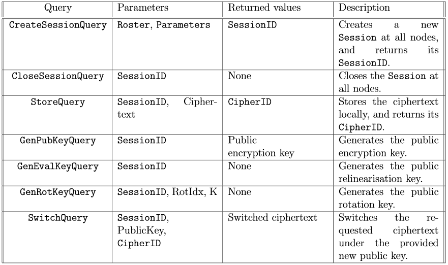
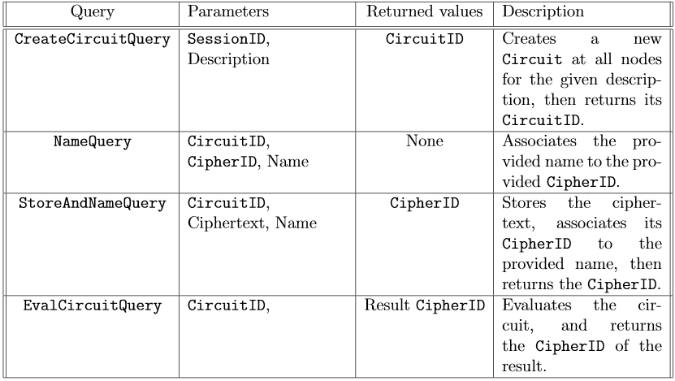

# Service

This package implements two services, the Session Service and the Circuit Service (they are disjoint for the sake of clarity and role separation):
the Session Service manages the sessions (virtual computation environments) and the distributed database of ciphertexts,
while the Circuit Service maintains an infrastructure for naming variables and offers a high-parallelism distributed circuit evaluation capability.

They are not isolated: the Circuit Service leverages the abstractions offered by the Session Service, which instead is independent.  
In doing so, however, the Circuit Service does not issue queries to the Session Service as a client:
instead, it retrieves the `session.Service` instance created by Onet at startup time (using Onet's dedicated method), then directly invokes the public methods it exposes. 

The set of queries accepted by the two services combined defines the API exposed to clients, 
whose ultimate goal is to enable the evaluation of arbitrary arithmetic circuits (with rotations) on integer inputs, while respecting SMC properties.

## Message exchange and terminology

Following is a brief description of the client-server and server-server interactions,
together with the relevant patterns and terminology.

### Client-Server

A `Client` sends a `Query` to a `Service` running on a server, which sends back a `Response`.  
Client-Server communication is synchronous, so the `Client` blocks until it receives a `Response`.  
The `Query` is handled by the `Service` in the `HandleQuery` method.

It is to be noted that the `Query`-`HandleQuery`-`Response` terminology is generic, as each query has its name.  
For example, a `StoreQuery` is intercepted by the `HandleStoreQuery` method, which sends back a `StoreResponse`.

### Server-Server

Some operations may require some interaction among servers (apart from the protocols, handled by the Network Layer).  
When this happens, the first server sends a `Request` to the second server, which intercepts it in the `processRequest` method.
Server-Server communication, however, is not synchronous: the `Reply` sent by the second server is intercepted by the first server in the `processReply` method, executed in a separate Goroutine.  
To overcome this limitation (synchronicity is needed), the Goroutine that sent the `Request` and the Goroutine that received the `Reply` synchronise on a channel, through which the `Reply` is sent.

It is to be noted that the `Request`-`processRequest`-`Reply`-`processReply` terminology is generic, as each request has its name.  
For example, a `SumRequest` is intercepted by the `processSumRequest` method, which sends back a `SumReply`, intercepted in the `processSumReply` method.

## Session Service

The Session Service manages sessions and the distributed database of ciphertexts and public keys.

### Session

A `Session` (defined in [session_store.go](session/session_store.go)) is a virtual computation environment, meaning that it is a context, characterised by the BFV parameter set and the set of parties, in which several circuit evaluations can take place.  
It is created and destroyed through dedicated protocols (`CreateSessionProtocol` and `CloseSessionProtocol`, defined in [protocols](protocols)).  
It is identified by the same `SessionID` at all nodes.

### Ciphertexts

The database of ciphertexts is distributed because each ciphertexts is only stored at one node (called its "owner").  
A ciphertexts is globally indexed by its `CipherID` (defined in [messages.go](messages/messages.go)) which, besides a local identifier, holds a reference to the owner of the ciphertext.  
This way, the Session Service can abstract away the fact that ciphertexts are not replicated at all nodes by letting the `Session` type expose the `GetCiphertext` method,
used to retrieve any ciphertext given its `CipherID`, whether local or remote (if remote, a `GetCipherRequest`-`GetCipherReply` message exchange is necessary).  

This mechanism is implemented in [database.go](session/database.go) and [req_getcipher.go](session/req_getcipher.go).

### Public keys

Public keys are generated through protocols; as discussed in the protocols' [README](../protocols/README.md), the final result (the public key) is only available at the root.  
To overcome this inconvenient, the protocol factories provided by the Session Service to the Onet library set a field in the `session.Service` structure, indicating the root of the tree (for the current protocol instance) as the "owner" of that key.  
Thus, the Session Service can abstract away the fact that public keys are not replicated at all nodes by letting the `Session` type expose methods to retrieve the public keys, whether they are local or remote (again, if remote, a `Request`-`Reply` message exchange is necessary).  

This mechanism is implemented in [keys.go](session/keys.go), [req_getpubkey.go](session/req_getpubkey.go), [req_getevalkey.go](session/req_getevalkey.go), and [req_getrotkey.go](session/req_getrotkey.go).

### Queries

The table below summarises the queries accepted by the Session Service.

## Circuit Service

The Circuit Service allows associating names to variables, and enables high-parallelism circuit evaluation.

### Circuit

A Circuit (defined in [circuit_store.go](circuit/circuit_store.go)) represents a polynomial function, with rotations.  
It is represented by a Reverse Polish Notation description string, which is parsed into an `OperationTree` structure enabling its evaluation.  
It is created and destroyed after evaluation with dedicated protocols (`CreateCircuitProtocol` and `CloseCircuitProtocol`, defined in [protocols](protocols)).  
It is identified by the same `CircuitID` at all nodes.

### Variable names

The naming infrastructure is organised in a distributed name->`CipherID` correspondence that mirrors exactly the `CipherID`->ciphertext correspondence put up by the Session Service.  
A `CipherID` can be associated a locally-valid *variable name*, which induces a globally-valid *full name* built as \<variable name>@\<owner>, where the *owner" is the node storing that correspondence.  
As before, the Circuit Service lets the `Circuit` type expose the `GetCipherID` method to resolve any variable's full name, whether local or remote (a `GetCipherIDRequest`-`GetCipherIDReply` message exchange is necessary, if remote).  

This mechanism is implemented in [names.go](circuit/names.go) and [req_getcipherid.go](circuit/req_getcipherid.go).

### Circuit evaluation

Circuit evaluation is distributed (since different parties carry out homomorphic operations), but micro-managed by a central *orchestrator* node in a parallel way.

#### Distribution of computations

The orchestrator node outsources every single elementary operation of the `Circuit` to a party (one that already owns one of the input ciphertexts, so as to minimes the ciphertext transfer).  
This delegation is done by means of a `Request`-`Reply` message exchange: the `Request` only contains the `CipherID`s of the operands, and the `Reply` only contains the `CipherID` of the result.  

This mechanism is implemented in [req_e2s.go](circuit/req_e2s.go), [req_mult.go](circuit/req_mult.go), [req_refresh.go](circuit/req_refresh.go), [req_relin.go](circuit/req_relin.go), [req_rot.go](circuit/req_rot.go), [req_s2e.go](circuit/req_s2e.go), and [req_sum.go](circuit/req_sum.go).

#### Parallelism at the orchestrator

The orchestrator does not send out one `Request` at a time; instead, the `OperationTree` structure exposes an `Evaluate` method allowing for high-parallelism evaluation.  
This method only provides parallelism, not distributed evaluation: the functions that delegate the computations by sending a `Request` and waiting for a `Reply` are supplied by the Circuit Service to the `OperationTree` structure as mere worker functions that carry out elementary operation.

The `Evaluate` method launches a Goroutine for every node in the `OperationTree`, providing to each an output channel on which to write the `CipherID` of the result of their task.  
Non-leaf Goroutines are tasked with actual homomorphic operations: they wait on their children's channels to get the inputs' `CipherID`s,
then perform the operation (by calling the worker function), then send the output `CipherID` through the output channel.   
Leaf Goroutines, on the other hand, are tasked with resolving variable's full names (variables are referenced through their full name in the RPN circuit description). 
They do so by calling the `Circuit.GetCipherID` method (also supplied as a worker function) and sending the output `CipherID` through the output channel.

This mechanism is implemented in the [tree](circuit/tree) sub-package.

### Queries

The table below summarises the queries accepted by the Circuit Service.

